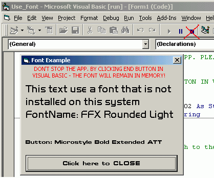



## Use a font

### Description

Use a font that is not installed on the system.

GetFontName > AddFontResource | RemoveFontResource
 
### More Info
 

             |
---                |---
**Submitted On**   |2002-08-05 00:49:08
**By**             |[Constantin Popescu](https://github.com/Planet-Source-Code/PSCIndex/blob/master/ByAuthor/constantin-popescu.md)
**Level**          |Intermediate
**User Rating**    |4.3 (13 globes from 3 users)
**Compatibility**  |VB 5\.0
**Category**       |[Miscellaneous](https://github.com/Planet-Source-Code/PSCIndex/blob/master/ByCategory/miscellaneous__1-1.md)
**World**          |[Visual Basic](https://github.com/Planet-Source-Code/PSCIndex/blob/master/ByWorld/visual-basic.md)
**Archive File**   |[Use\_a\_font114274842002\.zip](https://github.com/Planet-Source-Code/constantin-popescu-use-a-font__1-37630/archive/master.zip)

